**《操作系统课程设计》**

**（2018/2019学年第一学期第17周）**

**班级：16计算机3班**

**姓名：康宇哲**

  
**操作系统课程设计**

**目 录**

[一、题目： 3](#_Toc187586616)

[二、设计目的和要求： 4](#_Toc187586617)

[三、设计思路和方法： 5](#_Toc187586618)

[四、实现的功能及说明： 19](#_Toc187586619)

[五、核心源程序代码和界面图： 31](#_Toc187586621)

[六、心得体会： 32](#_Toc187586622)

1.  **题目**

>   **1.** 基于树莓派的嵌入式linux操作系统设计

**二、设计目的和要求**

**1.设计目的**

>   树莓派
>   OS需要有自己的调度程序。如果实现一个调度程序，还必须处理定时器中断。定时器中断意味着操作系统应该支持一些驱动程序并提供系统调用以将它们暴露给用户应用程序。在此基础上编写驱动程序使之在屏幕上写入内容并从键盘读取用户输入的指令。此外，操作系统需要能够加载和执行用户程序，因此需要支持某种文件系统并能够理解某种可执行文件格式。

>   树莓派搭载了一枚ARM架构64位4核心SOC（BCM2835）主频为700MHZ,SOC为片上操作系统支持精简指令集，并且板载了512MB
>   DDR2内存。该单板机系统支持SD卡Boot启动。在BCM2835启动时会通过Boot目录启动。树莓派启动分为以下步骤

-   **First stage bootloader**

>   树莓派上电后，SoC 中的 bootloader 首先被执行，其作用是挂载 SD 卡上的 FAT32
>   分区，从而加载下一阶段的 bootloader。这部分程序被固化在 SoC 的 ROM
>   中，用户无法修改。

-   **Second stage bootloader (bootcode.bin)**

>   这个阶段的 bootloader 会从 SD 卡上检索 GPU 固件，将固件写入 GPU，随后启动
>   GPU。

-   **GPU firmware (start.elf)**

>   本阶段中，GPU
>   启动后会检索附加配置文件（config.txt、fixup.dat），根据其内容设置 CPU
>   运行参数及内存分配情况，随后将用户代码加载至内存，启动 CPU。

-   **User code (kernel8.img)**

>   通常情况下，CPU 启动后便开始执行 kernel8.img
>   中的指令，初始化操作系统内核，在某些情况下，也可以被 U-BOOT 代替，由 U-BOOT
>   来加载内核。在树莓派 1 代中，User code 部分被保存在 kernel.img 文件中，2
>   代中，该文件更名为 kernel7.img，3 代中，该文件更名为
>   kernel8.img，本课程设计的全部工作，都在该文件上完成。

>   综上所述，树莓派上电后的初始化工作大多是在 GPU 中完成的（GPU 内的一颗 RSIC
>   核心用于完成这些操作）。目前树莓派的 GPU bootloader
>   仍未开源，只以二进制形式发布，因此本课程设计使用了官

>   方提供的 [raspberrypi/firmware](https://github.com/raspberrypi/firmware) 官方仓库中的bootcode.bin
>   和 start.elf，直接复制到 SD 卡Boot目录。

>   树莓派刻录了官方镜像以后boot分区文件展示。我们自制的操作系统会编译成kernel.Img文件替代官方的kernel.img文件。

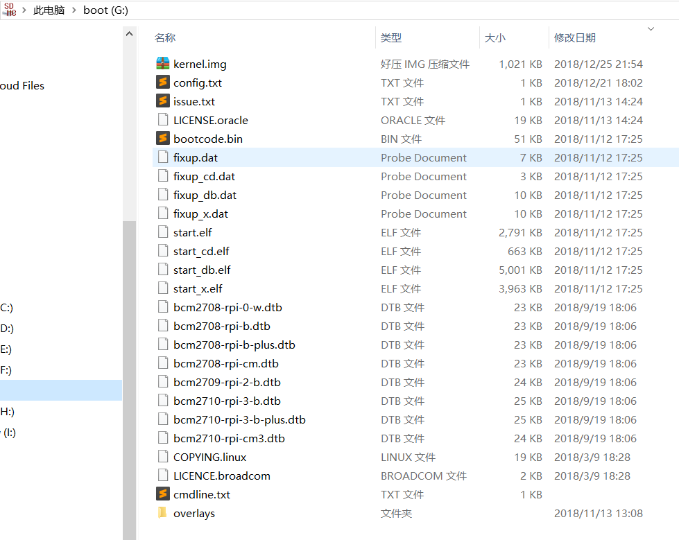

树莓派系统启动流程示意图

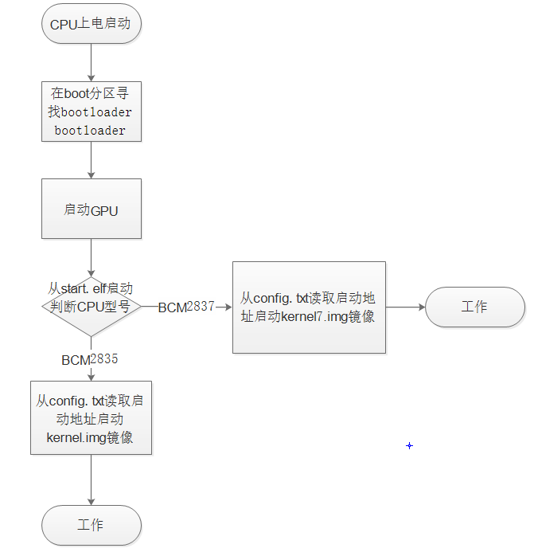

>   **2.设计要求**

综上在参考了

1.  《30 天自制操作系统》

2.  《嵌入式实时操作系统 uc/os III》

3.  《linux 内核设计的艺术》

4.  《Linux 0.01 内核分析与操作系统设计》  

>   这几本书以后综合自己的能力对该嵌入式树莓派操作系统提出了以下几个可以完成的功能。

1.  提供 GPIO 处理函数；

2.  GUI 界面，有窗体 demo， 窗体可对鼠标操作做出相应；

3.  默认分辨率 1440×900；

4.  可显示 bmp 24 位色（true color）图片；

5.  支持鼠标键盘输入设备；

6.  多任务，默认最多 16 个任务；

7.  时间片轮转调度；

8.  任务间通信；

9.  任务阻塞，挂起；

10. 支持动态申请内存；

11. 系统最多支持 255 个 timer 定时器；

12. 支持 UART 通信。

**三、设计思路与方法**

**1.设计操作系统的基础依赖**

本课程设计要完成多进程与内存管理，需要系统时钟定时器和中断。故设计了定时器和中断函数并设置寄存器。

\#\#\#中断向量

\* 树莓派Zero搭载的是BCM2835的处理器。BMC2835 ARM1176
是ARMv6版本的。在默认条件下，处理器加电后会自动加载SD卡中的kernel.img到内存0x8000处。

\* ARM的中断向量是在地址0x00 - 0x20

\* 0x00 复位 reset

\* 0x04 未定义指令

\* 0x08 软终端 SWI

\* 0x0c 指令预取指

\* 0x10 数据访问中止

\* 0x14 保留

\* 0x18 IRQ

\* 0x1c FIQ

所以内核加载到内存做的第一件事应该是设置好中断向量。

**ARM外设中断表：**

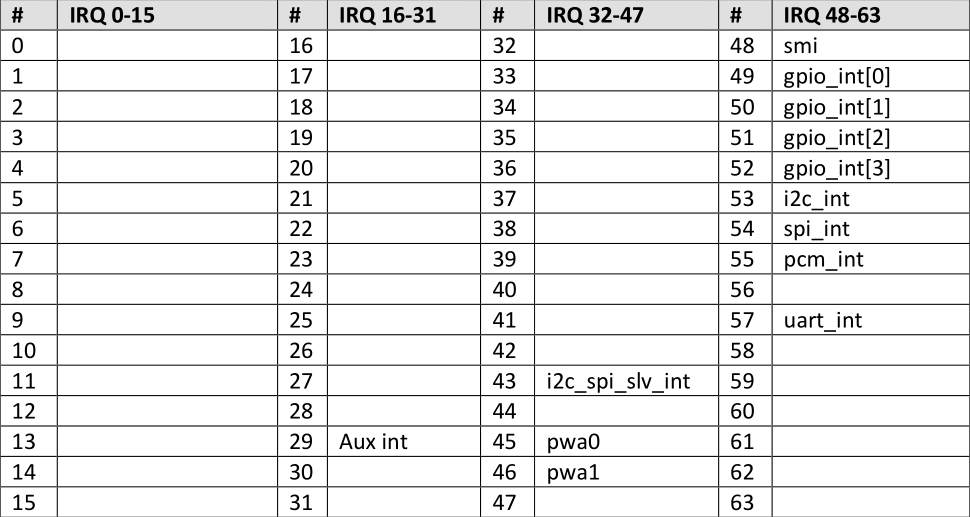

\#\#\#ARM处理器模式

ARM处理器共有7中模式，每种模式的寄存器会有些不同。OS
One默认运行在SUPERVISOR模式下，当IRQ中断发生时运行在IRQ模式。OS
One只使用了这两种模式。

CPSR中[4:0]表示处理器所处的模式

\* 0b10000 USER

\* 0b10001 FIQ

\* 0b10010 IRQ

\* 0B10011 SUPERVISOR

\* 0b10111 ABORT

\* 0b11011 UNDEFINEED

\* 0b11111 SYSTEM

设置中断向量和sp寄存器后，\`b \_cstartup\` 进入 startup.c中的\`_cstartup\`
函数。\`_cstartup\`最终会调用内核主函数 \`os_main()\`

\#\#\#中断

CPSR第7位是IRQ中断禁止位。两个相关函数\`_enable_interrupts\`和\`_enable_interrupts\`

这里定义两个头文件timer.h和interrupt.h用于计时器与中断。

中断函数参考剑桥大学树莓派操作系统设计项目和BCM2835 SOC技术手册

\#\#\#树莓派 interrupt  
\#\#\#\#1.Introduction  
\>\#\#\#\#\#ARM 共有两种中断源  
\>\>1.来自GPU外设的中断  
\>\>2.来自ARM控制外设  
  
\>\#\#\#\#\#ARM有三种中断  
\>\>1.来自ARM特殊外设  
\>\>2.来自GPU外设的中断  
\>\>3.特殊事件中断  
  
\>\#\#\#\#\#ARM特殊事件中断:  
\>\>1.一个定时器  
\>\>2.一个邮箱（GPU）  
\>\>3.两个门铃  
\>\>4.两个GPU空闲中断  
\>\>5.两个地址/访问错误中断  
\>\#\#\#\#\#邮箱和门铃寄存器不是通用的  
\>每一个中断源(GPU/ARM)都有一个使能位(R/W)和未决位(RO)  
\>默认门铃中断0,1和邮箱0只可被GPU写，ARM读。门铃中断2,3和邮箱中断1相反。  
\#\#\#\#2. Interrupt pending.  
\>ARM有三个中断未决寄存器，一个basic pending register 两个 GPU pending
registers.  
\>\#\#\#\#\#Basic pending register.  
\>\>The basic pending register has interrupt pending bits for the ARM specific
interrupts .  
\>\#\#\#\#\#GPU pending registers.  
\>\>There are two GPU pending registers with one bit per GPU interrupt source.  
\#\#\#\#3 Fast Interrupt (FIQ).  
\>  
The ARM also supports a Fast Interrupt (FIQ). One interrupt sources can be
selected to be connected  
to the ARM FIQ input. There is also one FIQ enable. An interrupt which is
selected as FIQ should have  
its normal interrupt enable bit cleared. Otherwise an normal and a FIQ interrupt
will be fired at the  
same time. Not a good idea!  
\#\#\#\#4 Interrupt priority.  
\>  
There is no priority for any interrupt. If one interrupt is much more important
then all others it can  
be routed to the FIQ. Any remaining interrupts have to be processed by polling
the pending registers.  
It is up to the ARM software to device a strategy. e.g. First start looking for
specific pending  
bits or process them all shifting one bit at a time.  
\#\#\#\#5 Registers 寄存器设置  
\>The base address for the ARM interrupt register is 0x7E00B000.  
\>  
\>  
Registers overview:  
\>  
0x200 IRQ basic pending  
0x204 IRQ pending 1  
0x208 IRQ pending 2  
0x20C FIQ control  
0x210 Enable IRQs 1  
0x214 Enable IRQs 2  
0x218 Enable Basic IRQs  
0x21C Disable IRQs 1  
0x220 Disable IRQs 2  
0x224 Disable Basic IRQs  
**中断寄存器地址表：**

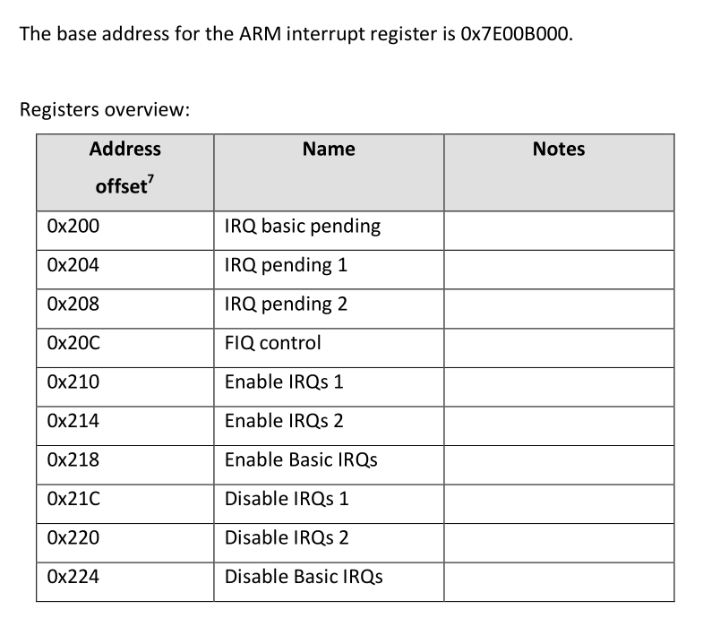

  
\>\#\#\#\#\#Basic pending register.  
\>\>  
The basic pending register shows which interrupt are pending. To speed up
interrupts processing, a  
number of 'normal' interrupt status bits have been added to this register. This
makes the 'IRQ  
pending base' register different from the other 'base' interrupt registers  
\>\>\#\#\#\#\#\#GPU IRQ x (10,11..20)  
\>\>\>  
These bits are direct interrupts from the GPU. They have been selected as
interrupts which are most  
likely to be useful to the ARM. The GPU interrupt selected are 7, 9, 10, 18, 19,
53,54,55,56,57,62. For  
details see the GPU interrupts table.  
\>\>\#\#\#\#\#\#Bits set in pending registers (8,9)  
\>\>\>  
These bits indicates if there are bits set in the pending 1/2 registers. The
pending 1/2 registers hold  
ALL interrupts 0..63 from the GPU side. Some of these 64 interrupts are also
connected to the basic  
pending register. Any bit set in pending register 1/2 which is NOT connected to
the basic pending  
register causes bit 8 or 9 to set. Status bits 8 and 9 should be seen as "There
are some interrupts  
pending which you don't know about. They are in pending register 1 /2."  
\>\>\#\#\#\#\#\#Illegal access type-0 IRQ (7)  
\>\>\>  
This bit indicate that the address/access error line from the ARM processor has
generated an  
interrupt. That signal is asserted when either an address bit 31 or 30 was high
or when an access was  
06 February 2012 Broadcom Europe Ltd. 406 Science Park Milton Road Cambridge CB4
0WW  
**2.内存初始化设置在这里定义 memory.h**

**与linux内存管理机制相似**

Linux物理内存和虚拟内存

　　直接从物理内存读写数据要比从硬盘读写数据要快的多，因此，我们希望所有数据的读取和写入都在内存完成，而内存是有限的，这样就引出了物理内存与虚拟内存的概念。

物理内存就是系统硬件提供的内存大小，是真正的内存，相对于物理内存，在linux下还有一个虚拟内存的概念，虚拟内存就是为了满足物理内存的不足而提出的策略，它是利用磁盘空间虚拟出的一块逻辑内存，用作虚拟内存的磁盘空间被称为交换空间（Swap
Space）。 

Linux 进程在内存数据结构

　　可以看到一个可执行程序在存储（没有调入内存）时分为代码段，数据段，未初始化数据段三部分：

代码段：存放CPU执行的机器指令。通常代码区是共享的，即其它执行程序可调用它。假如机器中有数个进程运行相同的一个程序，那么它们就可以使用同一个代码段。

数据段：存放已初始化的全局变量，静态变量（包括全局和局部的），常量。static全局变量和static函数只能在当前文件中被调用。

未初始化数据区（uninitializeddata
segment,BSS)：存放全局未初始化的变量。BSS的数据在程序开始执行之前被初始化为0或NULL。   
代码区所在的地址空间最低，往上依次是数据区和BSS区，并且数据区和BSS区在内存中是紧挨着的。。   
可执行程序在运行时又多出了两个区域：栈段（Stack）和堆段(Heap)。

栈区:由编译器自动释放，存放函数的参数值，局部变量等。每当一个函数被调用时，该函数的返回类型和一些调用的信息被存储到栈中。然后这个被调用的函数再为它的自动变量和临时变量在栈上分配空间。每调用一个函数一个新的栈就会被使用。栈区是从高地址位向低地址位增长的，是一块连续的内在区域，最大容量是由系统预先定义好的，申请的栈空间超过这个界限时会提示溢出，用户能从栈中获取的空间较小。

堆段:用于存放进程运行中被动态分配的内存段，位于BSS和栈中间的地址位。由程序员申请分配（malloc)和释放（free）。堆是从低地址位向高地址位增长，采用链式存储结构。频繁地malloc/free造成内存空间的不连续，产生碎片。当申请堆空间时库函数按照一定的算法搜索可用的足够大的空间。因此堆的效率比栈要低的多。

这个5中内存区域中数据段、BSS和堆通常是被连续存储的——内存位置上是连续的，而代码段和栈往往会被独立存放。有趣的是堆和栈两个区域关系很“暧昧”，他们一个向下“长”（i386体系结构中栈向下、堆向上），一个向上“长”，相对而生。但你不必担心他们会碰头，因为他们之间间隔很大（到底大到多少，你可以从下面的例子程序计算一下），绝少有机会能碰到一起。

下图简要描述了进程内存区域的分布：   

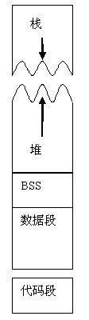

Linux内存初始化流程

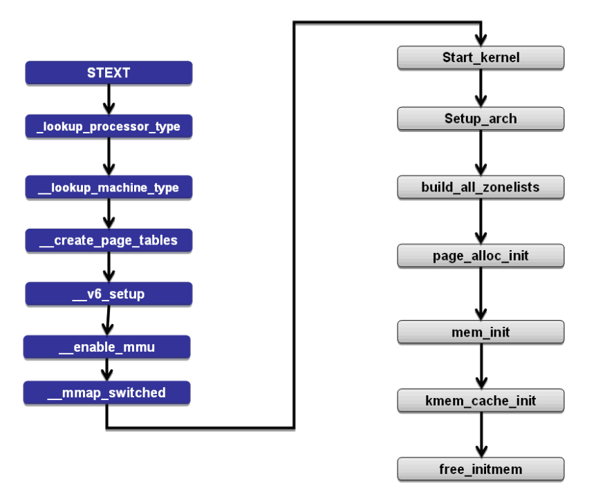

**2.定义常用的数据结构LinkList与FiFo队列**

在这里定义fifo.h做队列设计、linklist.h做链表设计用于内存动态申请。

**void ll_init(LinkedList \*ll); //使用之前必须初始化**

**u8 ll_add_to_head(LinkedList \*ll, u32 value); //加新节点到头部**

**u8 ll_add_to_tail(LinkedList \*ll, u32 value); //加新节点到尾部**

**u8 ll_add_by_order(LinkedList \*ll, u32 value, u32
sort_value);//按sort_value的顺序加入链表(这个函数貌似有点问题)**

**u8 ll_add_after_id(LinkedList \*ll,u32 value, u8 new_prior);
//加到所给id后面**

**u8 ll_remove_by_id(LinkedList \*ll, u8 id); //通过id删除结点**

**u8 ll_remove_head(LinkedList \*ll); //从头部删除**

**u8 ll_remove_tail(LinkedList \*ll); //从尾部删除**

**u8 ll_get_next_id(LinkedList \*ll, u8 id); //得到下一个节点的数组下标(id)**

**u8 ll_get_prior_id(LinkedList \*ll, u8 id); //得到上一个节点的数组下标**

**u32 ll_get_value(LinkedList \*ll, u8 id); //取值**

**u8 ll_get_tail_id(LinkedList \*ll); //得到尾部节点id**

**u8 ll_get_head_id(LinkedList \*ll); //头节点id**

**u8 ll_set_value(LinkedList \*ll, u8 id, u32 value); //重新设置值**

创建结点

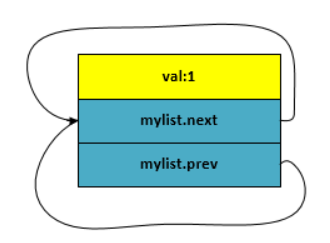

插入结点

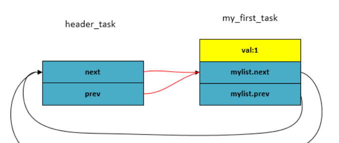

插入第二个

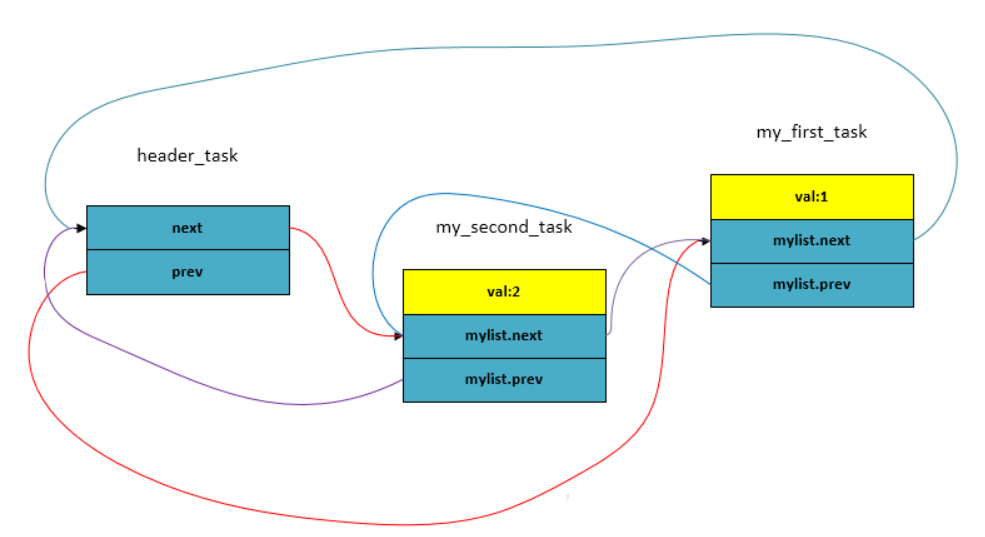

fifo.h做队列设计

**void fifo_init( FIFO8 \* fifo8,char \* buf,int size); //初始化**

**void fifo_put( FIFO8 \* fifo8,char data); //如队列**

**char fifo_get( FIFO8 \* fifo8); //出队列**

环形队列缓冲区

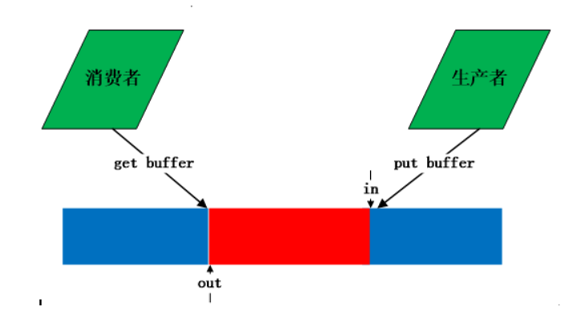

Get put方法

static inline unsigned int kfifo_put(struct kfifo \*fifo,

const unsigned char \*buffer, unsigned int len)

{

unsigned long flags;

unsigned int ret;

spin_lock_irqsave(fifo-\>lock, flags);

ret = \__kfifo_put(fifo, buffer, len);

spin_unlock_irqrestore(fifo-\>lock, flags);

return ret;

}

static inline unsigned int kfifo_get(struct kfifo \*fifo,

unsigned char \*buffer, unsigned int len)

{

unsigned long flags;

unsigned int ret;

spin_lock_irqsave(fifo-\>lock, flags);

ret = \__kfifo_get(fifo, buffer, len);

//当fifo-\>in == fifo-\>out时，buufer为空

if (fifo-\>in == fifo-\>out)

fifo-\>in = fifo-\>out = 0;

spin_unlock_irqrestore(fifo-\>lock, flags);

return ret;

}

unsigned int \__kfifo_put(struct kfifo \*fifo,

const unsigned char \*buffer, unsigned int len)

{

unsigned int l;

//buffer中空的长度

len = min(len, fifo-\>size - fifo-\>in + fifo-\>out);

/\*

\* Ensure that we sample the fifo-\>out index -before- we

\* start putting bytes into the kfifo.

\*/

smp_mb();

/\* first put the data starting from fifo-\>in to buffer end \*/

l = min(len, fifo-\>size - (fifo-\>in & (fifo-\>size - 1)));

memcpy(fifo-\>buffer + (fifo-\>in & (fifo-\>size - 1)), buffer, l);

/\* then put the rest (if any) at the beginning of the buffer \*/

memcpy(fifo-\>buffer, buffer + l, len - l);

/\*

\* Ensure that we add the bytes to the kfifo -before-

\* we update the fifo-\>in index.

\*/

smp_wmb();

fifo-\>in += len; //每次累加，到达最大值后溢出，自动转为0

return len;

}

unsigned int \__kfifo_get(struct kfifo \*fifo,

unsigned char \*buffer, unsigned int len)

{

unsigned int l;

//有数据的缓冲区的长度

len = min(len, fifo-\>in - fifo-\>out);

/\*

\* Ensure that we sample the fifo-\>in index -before- we

\* start removing bytes from the kfifo.

\*/

smp_rmb();

/\* first get the data from fifo-\>out until the end of the buffer \*/

l = min(len, fifo-\>size - (fifo-\>out & (fifo-\>size - 1)));

memcpy(buffer, fifo-\>buffer + (fifo-\>out & (fifo-\>size - 1)), l);

/\* then get the rest (if any) from the beginning of the buffer \*/

memcpy(buffer + l, fifo-\>buffer, len - l);

/\*

\* Ensure that we remove the bytes from the kfifo -before-

\* we update the fifo-\>out index.

\*/

smp_mb();

fifo-\>out += len; //每次累加，到达最大值后溢出，自动转为0

return len;

}

　　put和get在调用__put和__get过程都进行加锁，防止并发。从代码中可以看出put和get都调用两次memcpy，这针对的是边界条件。例如下图：蓝色表示空闲，红色表示占用。

（1）空的kfifo，

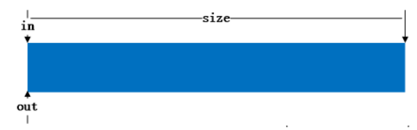

（2）put一个buffer后

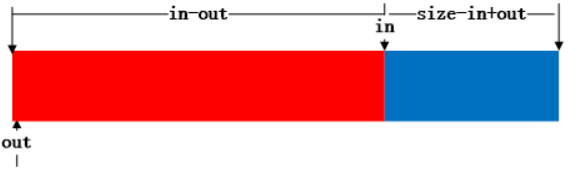

（3）get一个buffer后

（4）当此时put的buffer长度超出in到末尾长度时，则将剩下的移到头部去

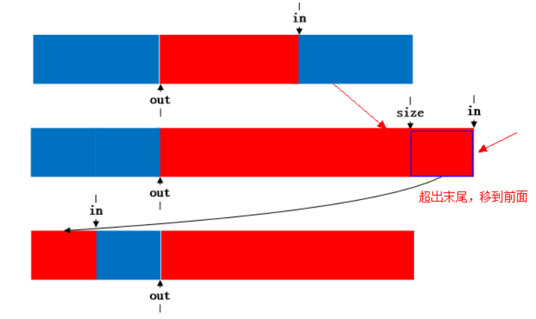

**3.设计GPU驱动和图像绘制图像处理相关函数**

**GPU.h/ GPU.cpp(底层参考了剑桥大学树莓派操作系统项目)**

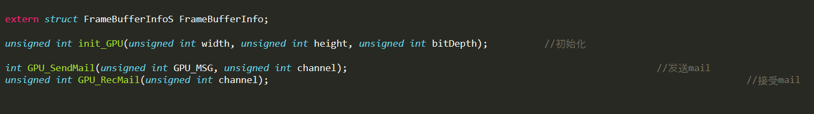

**Graphic.h/Graphic.cpp(底层参考了剑桥大学树莓派操作系统项目)**

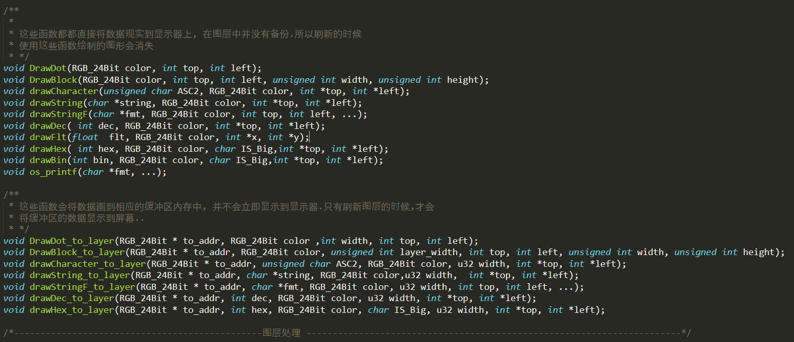

1.  **窗体设计form.c**

>   **使用了图层关键代码**

void form1()

{

//右上角x的图像

char x[9][9] = {

"OO\@\@\@\@\@OO",

"OOO\@\@\@OOO",

"\@OOO\@OOO\@",

"\@\@OOOOO\@\@",

"\@\@\@OOO\@\@\@",

"\@\@OOOOO\@\@",

"\@OOO\@OOO\@",

"OOO\@\@\@OOO",

"OO\@\@\@\@\@OO",

};

rect frect; //窗口矩形

struct picture fpic;

//设定窗体大小

fpic.Position.top = 200;

fpic.Position.left = 200;

fpic.Position.width = 300;

fpic.Position.hight = 200;

fpic.buf = os_malloc( 200 \* 300 \* 3); //申请内存存放窗体图像信息

form1_handle = add_pic(fpic);

add_pic_to_layer(form1_handle); //将fpic加入最上层

DrawBlock_to_layer(fpic.buf, colorWrite, 300, 30, 0, 300, 200); //白色底色

RGB_24Bit color; //标题栏,暗绿色

color.R = 0;

color.G = 200;

color.B = 0;

DrawBlock_to_layer(fpic.buf, color, 300, 0, 0, 300, 30); //画出标题栏

DrawBlock_to_layer(fpic.buf, colorRed, 300, 0, 300 - 5 - 25, 25, 20);
//画出关闭按钮底色

DrawBlock_to_layer(fpic.buf, colorRed, 300, 200 - 46 , 200 , 37 , 37);
//reboot按钮底色

//写标题

int top = 7;

int left = 20;

char str[14] = "Kernel status";

drawString_to_layer(fpic.buf , str , colorWrite , 300, &top, \&left);

top = 35; left = 5;

//窗体内容

drawString_to_layer(fpic.buf , "Task status" , colorRed , 300, &top, \&left);

top += 5;

int current_TRID = ll_get_head_id(task_ready);

while(0 != current_TRID )

{

top += 16; left = 10;

u8 TID = task_ready-\>node[current_TRID].value;

current_TRID = ll_get_next_id(task_ready, current_TRID);

}

top += 5;

top += 16, left = 5;

drawString_to_layer(fpic.buf , "Input status" , colorRed , 300, &top, \&left);

top += 5;

top += 16, left = 10;

top += 5;

top += 16, left = 5;

drawString_to_layer(fpic.buf , "Memory status" , colorRed , 300, &top, \&left);

//画出关闭按钮("X")

int i ,j ;

for(i = 0; i \< 9; i++)

{

for(j = 0; j \< 9; j++)

{

if(x[i][j] == 'O')

{

DrawDot_to_layer(fpic.buf , colorWrite, 300, 6 + i, 278 + j);

}

}

}

//刷新窗体(将内存中的图像信息线输出来)

pic_layer_reflash_rect(PicLayerTable-\>Picture[form1_handle].Position.top,
PicLayerTable-\>Picture[form1_handle].Position.left,
PicLayerTable-\>Picture[form1_handle].Position.width,
PicLayerTable-\>Picture[form1_handle].Position.hight);

//当接收到Task1的消息, 就刷新

while(true)

{

top = 35; left = 5;

top += 5;

int current_TRID = ll_get_head_id(task_ready); //第一个任务的TRID

while(0 != current_TRID )

{

top += 16; left = 10;

u8 TID = task_ready-\>node[current_TRID].value;

DrawBlock_to_layer(fpic.buf, color, 300, top, left, 280, 16);

if( current_TRID == 1)

{

drawStringF_to_layer(fpic.buf , "TASK%d stack: \*/1024 Byte free", colorBlack ,
300, top, left, TID );

}

else

{

drawStringF_to_layer(fpic.buf , "TASK%d stack: %d/1024 Byte free", colorBlack ,
300, top, left, TID, (u32)( (u32)task_table[TID].sp - (u32)task_stack[TID] ) );

}

pic_layer_reflash_rect(PicLayerTable-\>Picture[form1_handle].Position.top + top,
PicLayerTable-\>Picture[form1_handle].Position.left + left, 280, 16);

current_TRID = ll_get_next_id(task_ready, current_TRID);

}

top += 5;

top += 16, left = 5;

top += 5;

top += 16, left = 10;

DrawBlock_to_layer(fpic.buf, color, 300, top, left, 280, 16);

drawStringF_to_layer(fpic.buf , "top:%d left:%d Button:%d Key:%d", colorBlack ,
300, top, left, PicLayerTable-\>Picture[MouseHaldle].Position.top,
PicLayerTable-\>Picture[MouseHaldle].Position.left, input_status.button,
input_status.key );

pic_layer_reflash_rect(PicLayerTable-\>Picture[form1_handle].Position.top + top,
PicLayerTable-\>Picture[form1_handle].Position.left + left, 280, 16);

top += 5;

top += 16, left = 5;

top += 5;

top += 16, left = 10;

DrawBlock_to_layer(fpic.buf, color, 300, top, left, 100, 16);

drawStringF_to_layer(fpic.buf , "%d/%d M ", colorBlack , 300, top, left,
total_free_memory_size()/(1024 \* 1024), FreeMemoryTables-\>size/(1024 \*
1024));

pic_layer_reflash_rect(PicLayerTable-\>Picture[form1_handle].Position.top + top,
PicLayerTable-\>Picture[form1_handle].Position.left + left, 100, 16);

MSG_s \_msg = task_recevie_msg();

DrawBlock_to_layer(PicLayerTable-\>Picture[DesktopHandle].buf , colorB,
screen_width, 0, 5 + 150, 150, 16);

drawStringF_to_layer(PicLayerTable-\>Picture[DesktopHandle].buf , "Task2 Rev %d"
, colorWrite , screen_width, 0, 5 + 150 , \_msg.value);

pic_layer_reflash_rect(0, 5 + 150, 150, 32);

}

}

extern void reboot(void);

//窗体队鼠标的响应

void form1_dispose()

{

static u8 mouse_status = 255;

static u32 top, left;

if( input_status.button == 0)

{

if(mouse_status == 1)

{

//拖放操作松开的处理-\>移动窗体

move_pic_layer( PicLayerTable-\>Picture[MouseHaldle].Position.top - top,
PicLayerTable-\>Picture[MouseHaldle].Position.left - left, form1_handle,
absolute);

}

mouse_status = 0;

}

//判断鼠标是否在标题栏

bool is = is_inside (PicLayerTable-\>Picture[form1_handle].Position.top,
PicLayerTable-\>Picture[form1_handle].Position.left,
PicLayerTable-\>Picture[form1_handle].Position.width, 30,
PicLayerTable-\>Picture[MouseHaldle].Position.left,
PicLayerTable-\>Picture[MouseHaldle].Position.top );

if(is) //鼠标在窗体标题栏上

{

if(input_status.button == 1)

{

if(mouse_status == 0)

{

//拖放开始

top = PicLayerTable-\>Picture[MouseHaldle].Position.top -
PicLayerTable-\>Picture[form1_handle].Position.top;

left = PicLayerTable-\>Picture[MouseHaldle].Position.left -
PicLayerTable-\>Picture[form1_handle].Position.left;

}

mouse_status = 1 ;

}

}

**四、实现的功能及说明**

1.  提供 GPIO 处理函数；

2.  GUI 界面，有窗体 demo， 窗体可对鼠标操作做出相应；

3.  默认分辨率 1440×900；

4.  可显示 bmp 24 位色（true color）图片；

5.  支持鼠标键盘输入设备；

6.  多任务，默认最多 16 个任务；

7.  时间片轮转调度；

8.  任务间通信；

9.  任务阻塞，挂起；

10. 支持动态申请内存；

11. 系统最多支持 255 个 timer 定时器；

12. 支持 UART 通信。

在此简单设计了GPIO的功能用于提示系统状态

通过hdmi接口投放到显示器界面中一共用三个线程，task1发送一个自增的字符串，task2接收这个字符串，task3负责将即时信息刷新在显示器上的UI线程

本操作系统流程图

编译
----

**硬件**：Raspberry Pi Zero  
**工具链**：arm-none-eabi- V4.8.2交叉编译器

### kernel.img

make = make kernel.img -编译最终产生的 kernel.img  
make clean -清理项目

使用
----

1.  接上树莓派串口线，两个 LED 灯分别连接到 GPIO16 和
    GPIO19。这两个等会显示内核状态信息（不接这两个 LED 不影响系统运行）；

2.  编译 kernel.img 并复制到 SD 卡，覆盖原来的 kernel.img

3.  加电运行；

4.  移动鼠标，拖动窗口（未实现）；

5.  屏幕左上角显示 Task1 和 Task2 的通信状态；

6.  屏幕右上角显示四个 Timer 的状态；

7.  窗口显示 kernel status。分别有任务栈适用情况，鼠标键盘状态，空闲堆内存大小；

8.  键盘按键（未实现）；

9.  移动鼠标（未实现）。

>   Makefile设计

\#默认参数

DIR_SRC ?= ./source

DIR_INC ?= ./include

DIR_OBJ ?= ./object

DIR_LIB ?= ./lib

TARGET ?= kernel

\#

\#（1）Makefile中的 符号 \$\@, \$\^, \$\< 的意思：

\#　　\$\@ 表示目标文件

\#　　\$\^ 表示所有的依赖文件

\#　　\$\< 表示第一个依赖文件

\#　　\$? 表示比目标还要新的依赖文件列表

\#

\#（2）wildcard、notdir、patsubst的意思：

\#

\#　　wildcard : 扩展通配符

\#　　notdir ： 去除路径

\#　　patsubst ：替换通配符

GNU = arm-none-eabi-

CFLAGS += -mfpu=vfp -mfloat-abi=hard -march=armv6zk -mtune=arm1176jzf-s \\

\-nostartfiles -g -Wl,--verbose -c -I \${DIR_INC}

LFLAGS += -mfpu=vfp -mfloat-abi=hard -march=armv6zk -mtune=arm1176jzf-s \\

\-nostartfiles -g -Wl,-T,\${DIR_SRC}/pi.x -Wl,-Map,\${TARGET}.map

SRC = \$(wildcard \${DIR_SRC}/\*.c)

ASB = \$(wildcard \${DIR_SRC}/\*.s)

OBJ = \$(patsubst %.c,\${DIR_OBJ}/%.o,\$(notdir \${SRC}))

\#暂时不链接USB驱动

INC = \$(wildcard \${DIR_INC}/\*.h)

all:

make kernel.img

\${DIR_OBJ}/%.o: \${DIR_SRC}/%.c Makefile

\${GNU}gcc \${CFLAGS} -c \$\< -o \$\@

\${TARGET}.img: Makefile \${TARGET}.elf

\${GNU}objcopy \${TARGET}.elf -O binary \$\@

\${TARGET}.elf:\${OBJ} \${ASB} \${DIR_SRC}/pi.x

\#\${TARGET}.elf: Makefile \${OBJ} \${ASB} \${DIR_SRC}/pi.x

\@echo \${OBJ} \${LIB} \${ASB} \${SRC} \${GNU}

\${GNU}gcc \${LFLAGS} \${OBJ} \${ASB} -L \${DIR_LIB} -o \${TARGET}.elf

\#\${GNU}gcc \${LFLAGS} \${OBJ} \${ASB} -o \${TARGET}.elf

disasm:\${TARGET}.elf

\${GNU}objdump -S \$\< \> \${TARGET}.disasm

clean:

rm -rf ./object/\*.o

rm -rf \*.img \*.elf \*.disasm \*.map

install:kernel.img

sudo mkdir /media/breaker/boot

sudo mount /dev/sdc1 /media/breaker/boot

sudo cp kernel.img /media/breaker/boot

sudo umount /dev/sdc1

sudo rm -r /media/breaker/boot

rm:

sudo rm -rf /media/breaker/boot

编译流程图：

编译

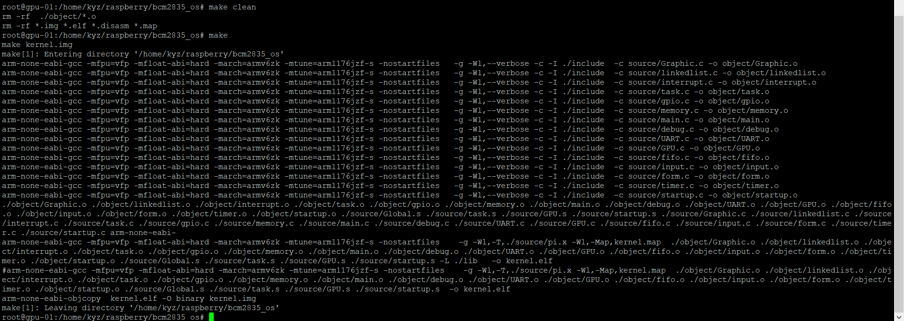

>   **五、核心源程序代码和界面图**

>   最终的代码（代码过多只截取目录详细代码上传至github，地址<https://github.com/kangyuzhe666>）

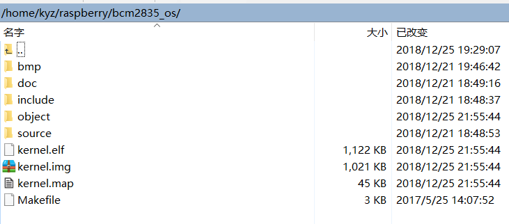

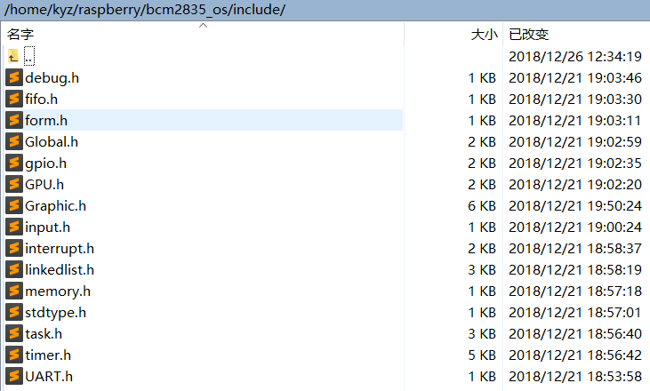

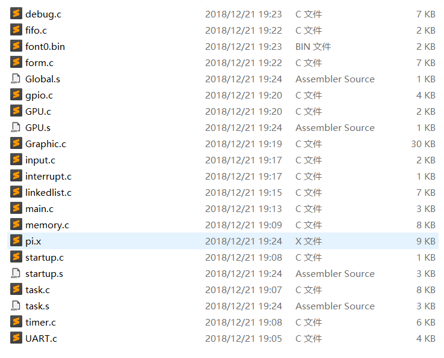

>   实现

>   树莓派硬件示意图：

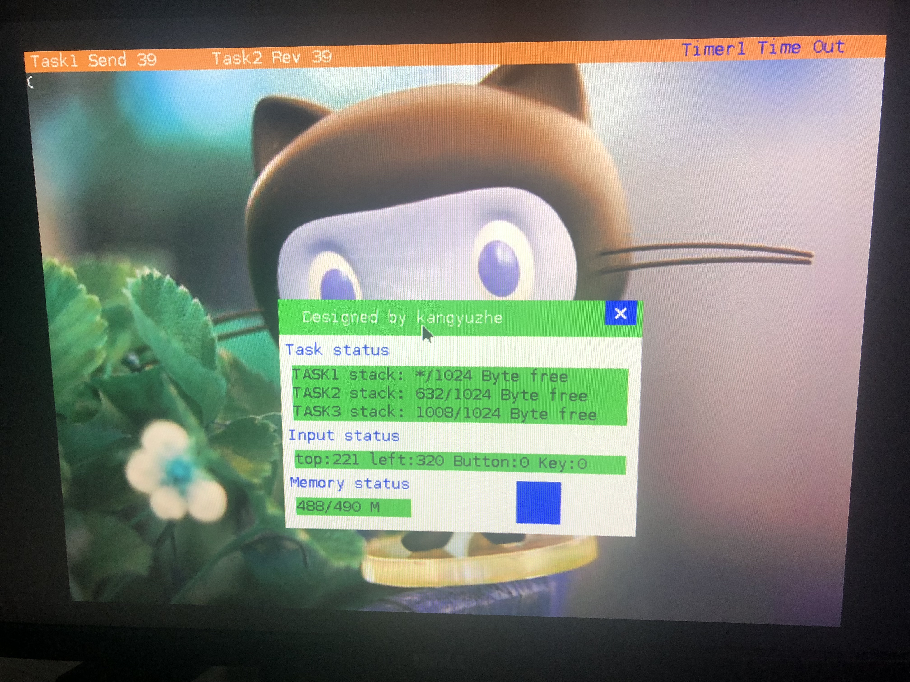

>   屏幕左上角显示 Task1 和 Task2 的通信状态；

>   屏幕右上角显示四个 Timer 的状态；

>   窗口显示 kernel status。分别有任务栈适用情况，鼠标键盘状态，空闲堆内存大小；

>   **六、心得体会**

>   **可以说是终于完成了从选题到结束一共花了3个星期查了好多英文资料有些还看不到，尤其是SOC的数据手册，基本上底层已经提供只是需要操作系统的基本功能代码量大概3w行左右其实也没啥。给我的感觉就是要有耐心期间还熬了一个通宵**
